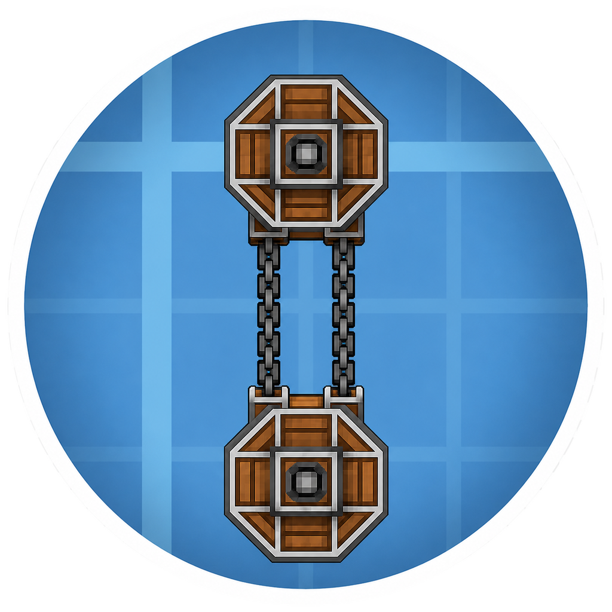

<p align="center">
  
</p>

# Create: Vertical Chain Conveyors

A NeoForge addon for Create that lets Chain Conveyors mount on floors, ceilings, and walls.

Vanilla Create Chain Conveyors are floor-mounted only. This mod extends Create's existing `chain_conveyor` block so the same item can be placed against any face and still participates in Create logistics: package movement, routing, chain rendering, selection previews, and ports.

## Features

- Place Chain Conveyors on all six mounting faces.
- Use the existing Create Chain Conveyor block and item; this mod does not register a replacement block.
- Render wheels, chains, selection outlines, and path preview lines in the mounted conveyor plane.
- Move packages through vertical and wall-mounted chains with axis-aware loop and travel math.
- Preserve connected chain state across world reloads.
- Keep floor-mounted Create behavior as close to vanilla as possible.

## Current Behavior

Chain links can be made between conveyors mounted on any face. Same-facing runs, floor-to-wall links, wall-to-ceiling links, and other mixed mounting directions all use the target conveyor's wheel plane when packages enter the next loop.

## Compatibility

- Minecraft: `1.21.1`
- NeoForge: `21.1.219+`
- Create: `6.0.x`
- Java: `21`

The mod is built and tested against Create `1.21.1-6.0.10`.

## Installation

Install this mod alongside Create in a NeoForge `1.21.1` instance.

Required mods:

- Create `6.0.x`
- NeoForge `21.1.219+`

Both the client and server should have the mod installed.

## Configuration

The per-world server config is written to
`world/serverconfig/verticalchainconveyors-server.toml` and is synchronized to
connected clients.

```toml
[connections]
allowSteepMixedAxisConnections = false
```

The default `false` preserves Create's 45-degree slope restriction. Set it to
`true` to allow steeper links only when the two conveyors rotate on different
axes, including coplanar floor-to-wall corners. Wheel clearance, minimum and
maximum distance, chain cost, and connection-count checks still apply. Changing
the option controls new connections and does not remove existing ones.

## Building From Source

On a normal Java 21 development environment, run from the repository root:

```sh
./gradlew build
```

For this repository's WSL-on-Windows development setup, use:

```sh
./scripts/gradle-win-java.sh build
```

The built jar is written to:

```text
build/libs/verticalchainconveyors-1.21.1-1.2.1.jar
```

The helper script stages the repo into a Windows-local workspace and runs `gradlew.bat` there with Java 21 to avoid NeoForge tooling stalls on `\\wsl.localhost\…` paths. It is not required for ordinary Linux, macOS, or Windows checkouts. Machine-specific Java, cache, workspace, and deployment paths should live in `CLAUDE.local.md`, which is ignored by git.

## Testing

Run the fast unit test suite:

```sh
./scripts/gradle-win-java.sh test
```

The tests cover the reusable conveyor math and retry policy, including wheel centers, tangent points, exhaustive mixed-axis validation reciprocity, slope boundaries, transfer angles, chain point sampling, selection-ray geometry, state transforms, delayed target resolution, and render section tracking.

Manual client checks are documented in `CLIENT_SMOKE_TESTS.md`.

## Development Notes

This mod works through Mixins against Create's Chain Conveyor classes. The main implementation lives under:

```text
src/main/java/com/osyris/verticalchainconveyors/
```

Key concepts:

- A `FACING` property is added to Create's Chain Conveyor block state.
- `FACING` represents the direction the conveyor's mounting face points.
- Geometry is calculated in the plane perpendicular to `FACING.getAxis()`.
- Floor-mounted `facing=DOWN` paths defer to Create's original behavior wherever practical.

When changing mixin method signatures, verify against the exact Create runtime jar resolved by Gradle, not only against a source checkout. A temporary local jar may be placed in ignored `libs/` for `javap` inspection. Loader/version differences can change method descriptors.

## License

This project is licensed under the MIT License. See `LICENSE`.

Portions of the implementation were copied or adapted from Create's MIT-licensed
code and modified for vertical and wall-mounted chain conveyors. See
`THIRD_PARTY_NOTICES.md` for attribution.

Create's assets remain under the Create project license. This mod references
Create assets and models at runtime but does not commit or redistribute Create's
mod jar, models, or texture files. The Create-style blueprint background used by
the project logo is credited separately in `THIRD_PARTY_NOTICES.md`.
